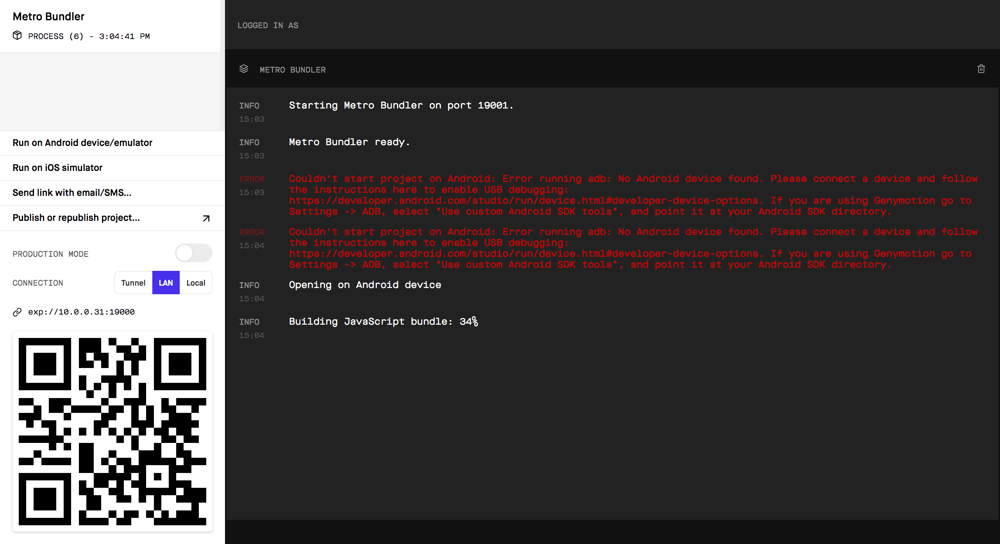
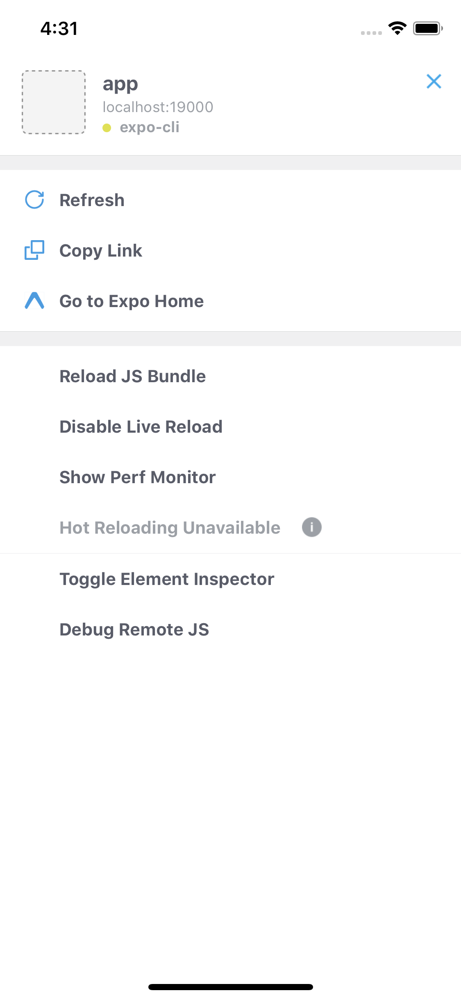

# React Native Playground 

Playground used to learn and experiment with [React Native](https://facebook.github.io/react-native/) using [TypeScript](https://www.typescriptlang.org/). This repository contains a bunch of pull requests documenting and implementing the process of how to create a React Native application with different features.

React Native lets you build mobile apps using only JavaScript. It uses the same design as React, letting you compose a rich mobile UI from declarative components.

List of pull requests:

* [How to create a React Native application.](https://github.com/pedrovgs/ReactNativePlayground/pull/1)
* [How to configure Travis CI.](https://github.com/pedrovgs/ReactNativePlayground/pull/2)

## How to run this app

Move into the ``app`` folder and execute the command ``yarn start``. This will open a site in your default browser asking you for deploying the app on an Android or iOS device just like this:

The terminal UI will also show a similar interface. You can use the QR code, directly deploy the app into your connected device or send an email to any user. As soon as the target device is in the same network ``expo`` will be able to run the app.

Once you get the app up and running, you'll be able to change anything in your app an the change will be automatically refreshed in your emulator or device :smiley:

Expo has a menu you can open from the iOS/Android emulator by pressing ``CMD + D`` or shaking your device. It looks like this:

License
-------

    Copyright 2018 Karumi

    Licensed under the GNU General Public License, Version 3 (the "License");
    you may not use this file except in compliance with the License.
    You may obtain a copy of the License at

       http://www.gnu.org/licenses/gpl-3.0.en.html

    Unless required by applicable law or agreed to in writing, software
    distributed under the License is distributed on an "AS IS" BASIS,
    WITHOUT WARRANTIES OR CONDITIONS OF ANY KIND, either express or implied.
    See the License for the specific language governing permissions and
    limitations under the License.
