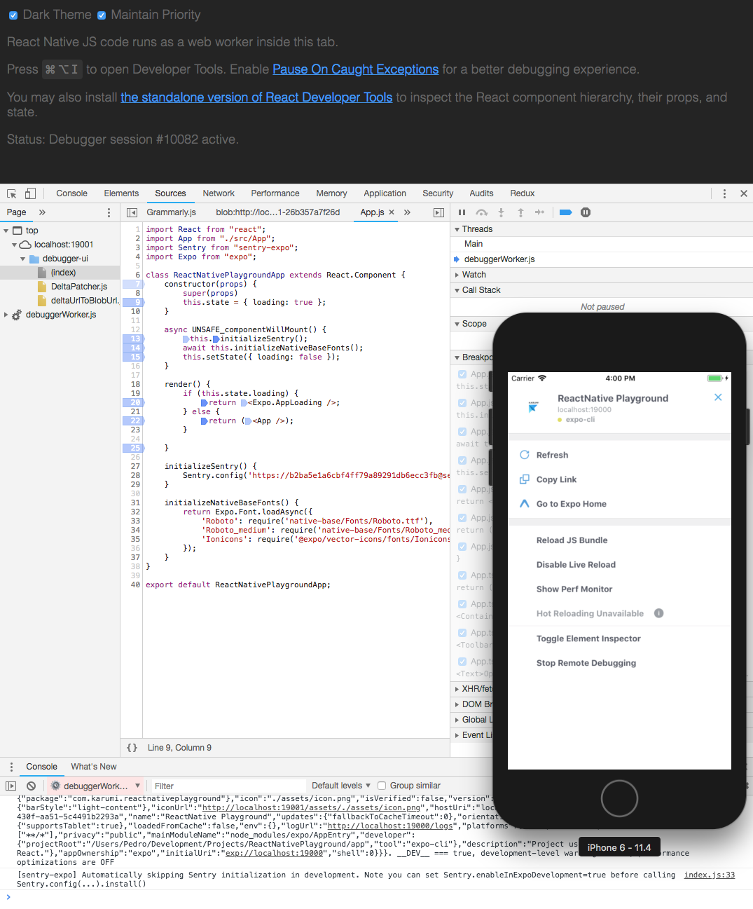

# React Native Playground [](https://travis-ci.com/Karumi/ReactNativePlayground)

Playground used to learn and experiment with [React Native](https://facebook.github.io/react-native/) using [TypeScript](https://www.typescriptlang.org/). This repository contains a bunch of pull requests documenting and implementing the process of how to create a React Native application with different features.


React Native lets you build mobile apps using only JavaScript. It uses the same design as React, letting you compose a rich mobile UI from declarative components.

List of pull requests:

* [How to create a React Native application.](https://github.com/Karumi/ReactNativePlayground/pull/1)
* [How to configure Travis CI.](https://github.com/Karumi/ReactNativePlayground/pull/2)
* [How to add Typescript and Jest support.](https://github.com/Karumi/ReactNativePlayground/pull/3)
* [Configure a crash reporter tool (Sentry).](https://github.com/Karumi/ReactNativePlayground/pull/4)
* [Configure a splash screen.](https://github.com/Karumi/ReactNativePlayground/pull/5)
* [Configure a Native Base library and create our own components.](https://github.com/Karumi/ReactNativePlayground/pull/6)
* [App localization.](https://github.com/Karumi/ReactNativePlayground/pull/7)
* [Remote debugging.](https://github.com/Karumi/ReactNativePlayground/pull/8)
* [Using static assets.](https://github.com/Karumi/ReactNativePlayground/pull/9)
* [Navigation between screens.](https://github.com/Karumi/ReactNativePlayground/pull/10)
* [List component.](https://github.com/Karumi/ReactNativePlayground/pull/11)

## How to run this app

Move into the ``app`` folder and execute the command ``yarn start``. This will open a site in your default browser asking you for deploying the app on an Android or iOS device just like this:


The terminal UI will also show a similar interface. You can use the QR code, directly deploy the app into your connected device or send an email to any user. As soon as the target device is in the same network ``expo`` will be able to run the app.

Once you get the app up and running, you'll be able to change anything in your app an the change will be automatically refreshed in your emulator or device :smiley:

Expo has a menu you can open from the iOS/Android emulator by pressing ``CMD + D`` or shaking your device. It looks like this:


## Running tests

We've added some tests to our playground so you can use the following commands to run our test cases:

```
yarn test # Runs every test
yarn testWatching # Starts a jest watcher running the tests just for the code you've changed.
yarn updateSnapshots # Updates all the snapshots recorded using jest.
yarn coverage # Runs every test and shows a small coverage report.
```

## Debugging

Our react-native application code can be inspected during the code execution using the Chrome DevTools app you've installed in your chrome browser. To start debugging the app you only need to open the ``expo`` debug menu by pressing ``CMD + D`` when the device up and running. Then you can press the button ``Start remote debugging`` and this will start a Chrome tab you can use to inspect your code, add breakpoints, evaluate js code and perform many many other debugging tasks:



The debugger UI will always be available for you from [this link](http://localhost:19001/debugger-ui/).

If for any reason, the ``expo`` debug menu does not work when using ``CMD + D`` shorcut, you can try to change the device from the ``Simulator > Hardware > Device`` menu.

If you need to inspect the nodes in your react UI you can run ``yarn react-devtools`` and this will open an electorn app you can use to inspect your view hierarchy.

When talking about the app state. You can always open the ``Redux`` tab in your Chrome inspector and this will let you review all the actions thrown and review the app state as you can do with a recular react web application.

**You can always add some ``console.log`` or ``console.error`` traces and this will be shown to the developer as part of the ``expo`` UI and the Chrome inspector console.**

***If for some reason your app deploy fails on the real device you are using to test your app because of a timeout exception, check if your laptop and the device you are using are in the same network twice. This error is shown just when the expo IP is not reachable.***

License
-------

    Copyright 2018 Karumi

    Licensed under the GNU General Public License, Version 3 (the "License");
    you may not use this file except in compliance with the License.
    You may obtain a copy of the License at

       http://www.gnu.org/licenses/gpl-3.0.en.html

    Unless required by applicable law or agreed to in writing, software
    distributed under the License is distributed on an "AS IS" BASIS,
    WITHOUT WARRANTIES OR CONDITIONS OF ANY KIND, either express or implied.
    See the License for the specific language governing permissions and
    limitations under the License.
